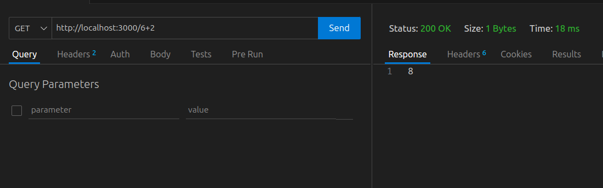
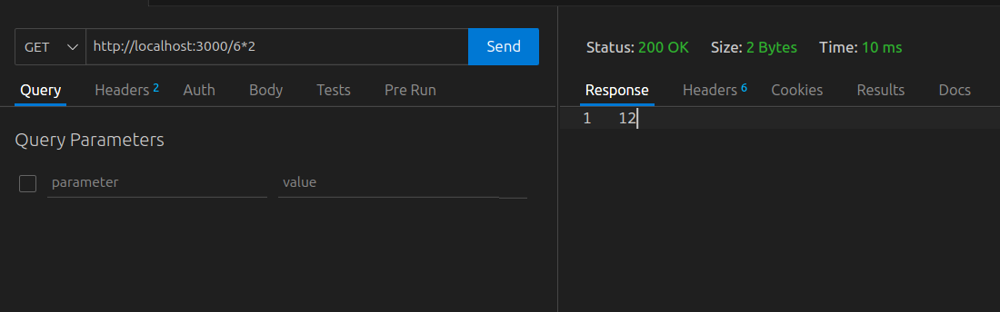
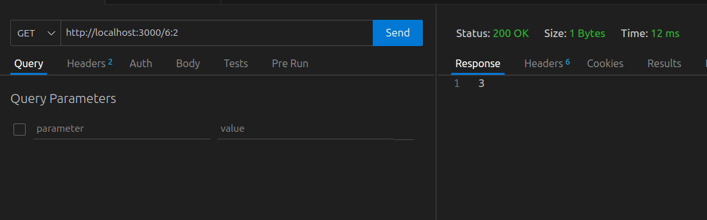

### запуск

Команда `docker compose up -d` разворачивает rabbitMQ и оба микросервиса.

Первый микросервис слушает на http://localhost:3000 и посылает запросы второму (через rabbitMQ).
Второй микросервис доступен только через rabbitMQ.

### фукциональность

Какого рода задачи должны передаваться 2 сервису не сказано.
Взял наиболее простой вариант - 2 сервис будет предствалять из себя простейший калькулятор.

Первый микросервис получит запрос и отправит задачу подсчета в RabbitMQ.
Второй микросервис извлечет эту задачу из очереди, посчитает и отправит в очередь ответ.
Первый микросервис вернте этот ответ на клиент.

- http://localhost:3000/6+2   - вернет 8
- http://localhost:3000/6-2   - вернет 4
- http://localhost:3000/6*2   - вернет 12
- http://localhost:3000/6:2   - вернет 3

